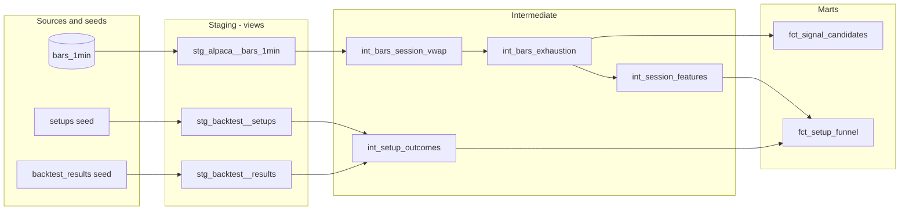

# equities-dbt-bigquery

**Built a dbt + BigQuery analytics pipeline — designed, tested, and documented data models that
turn raw market data into analysis-ready marts.**

A layered dbt project (staging → intermediate → marts) over real data from my own
[parabolic-reversal trading engine](https://github.com/BColladoT/parabolic-reversal-trading-engine):
micro-cap equity bars modeled into a signal-candidate mart and a setup funnel, with data-quality
tests and auto-generated lineage docs. Runs on DuckDB locally and BigQuery in prod from one codebase.

> ### 🔗 This repo is one half of a two-part system — both built by me
>
> - **[parabolic-reversal-trading-engine](https://github.com/BColladoT/parabolic-reversal-trading-engine)** (Python) — generates the raw market data.
> - **this repo** (dbt + BigQuery) — models that data into tested, documented, analysis-ready marts.
>
> They're deliberately **separate repos**, because analytics-engineering code lives apart from
> application code — the way it's structured on a real data team. Same author, one end-to-end
> pipeline: **the engine produces the data; this project turns it into analysis.**

<!-- CV line (verbatim): Built a dbt + BigQuery analytics pipeline — designed, tested, and
     documented data models that turn raw market data into analysis-ready marts. -->

_(Scale/volume specifics — row counts, test counts, cost, the reimplementation finding — live in
the sections below. They're interview ammunition, not the headline.)_

---

## Read this first — scope, honestly stated

This is **one dbt project over a subset of my own data**. It is not two years of dbt in
production, and nothing here should be read that way.

| | status |
|---|---|
| **dbt DAG, models, tests, docs** | ✅ built and running |
| **`dbt build` (DuckDB dev)** | ✅ 52 pass, 0 errors, 1 expected warning |
| **`dbt build` (BigQuery prod)** | ✅ **53 pass, 0 errors, 0 warnings** |
| **DuckDB dev target** | ✅ runs today, on any machine, no cloud account needed |
| **BigQuery prod target** | ✅ **loaded + built** — 20,391,519 rows, project `quant-trading-502717`, EU |
| **Cost so far** | ✅ **€0.00** — 1.26 GB of a 10 GiB free tier; €1 budget alert live |
| **Primary visual** | ✅ dbt lineage graph — rendered below (Mermaid) + interactive via `dbt docs` |
| **Looker Studio dashboard** | ⚪ optional — [recipe kept](docs/looker_studio_guide.md) for a ~10-min spin-up if a role specifically wants Looker/BI; not a core deliverable |
| **All metrics below** | ⚠️ **IN-SAMPLE.** Walk-forward out-of-sample validation in progress. |

Both targets are real and both have run. The 20.4M-row bar table is loaded into BigQuery
(partitioned by date, clustered by symbol), all 9 models materialise there, and all 53 tests pass
— including the `relationships` test at **error** severity, which on prod proves every one of the
909 setups' symbols has bars. Total spend to date: **€0.00**, verified against a €1 budget alert.

## The numbers, with the denominator attached

```
909 candidate setups  →  327 actually traded  →  258 wins  =  78.9% win rate
                         582 never triggered an entry
```

**78.9% is the win rate on executed trades** — which is how win rate is conventionally computed,
and it is correct. But 582 of 909 candidates (64%) never triggered at all, and that number belongs
next to the headline rather than behind it. `fct_setup_funnel` surfaces all three stages as
columns for exactly this reason.

**IN-SAMPLE. Walk-forward out-of-sample validation is in progress.** These are not live, audited,
or validated results.

## The DAG



*GitHub renders the graph above natively — it is generated from the same 11 dependency edges dbt
tracks in `manifest.json`.* For the **full interactive lineage graph** (column-level detail, tests,
and compiled SQL per model): `dbt docs generate && dbt docs serve`.

### The layer rule

- **staging** — *"what does the source say?"* One model per source, 1:1 rows, rename + cast. No
  joins, no business logic.
- **intermediate** — the bridge. Logic several marts need, that would make a mart unreadable
  inlined. Nobody queries it directly.
- **marts** — *"what does the business ask?"* Grain is a business entity.

### Why session VWAP is intermediate, not staging

Row grain doesn't settle it — it's one row per bar either way. **Ownership** does:

> `bar_vwap` exists because **Alpaca** sends it. `session_vwap` exists because **my strategy**
> invented a 09:30 anchor. Vendor changes their feed → I fix staging. I move my anchor to
> premarket → I fix intermediate. They never touch the same file.

## Two targets, one codebase

| target | engine | data | status |
|---|---|---|---|
| `dev` | DuckDB | committed 10-symbol sample (220,388 real rows, 5.1 MB) | runs today |
| `prod` | BigQuery | 573 symbols, 20,391,519 rows, 1.26 GB | configured, unrun |

```bash
dbt build              # dev — works immediately after `dbt deps`, no credentials
dbt build --target prod   # needs a GCP project + the bq load (see load/)
```

The sample is **real data, not synthetic**, and deliberately spans all three funnel branches
(59 setups: 24 traded, 19 won) so the marts are genuinely exercised. It's committed so that
`dbt build` works for anyone who clones this — including you, right now.

SQL is portable across both engines: `a / nullif(b,0)` rather than BigQuery's `safe_divide()`,
`sum(case when …)` rather than `countif()`, a ranked window rather than
`array_agg(…)[offset(0)]`. Timezone conversion is the one place the engines genuinely disagree,
so it lives in a single macro (`macros/to_et.sql`) — **never a hardcoded UTC offset**, because
New York is UTC-5 in winter and UTC-4 in summer and hardcoding either silently shifts every bar
by an hour for half the year.

## Finding: SQL signals vs the tick backtest disagree ~42% of the time

`fct_signal_candidates` **reimplements** the strategy's entry rules in SQL. It does **not**
reproduce the original backtest, and the two do **not** validate each other:

| | tick backtest | this project |
|---|---|---|
| input | tick trades → 60s bars | Alpaca 1-minute bars |
| VWAP anchor | first bar of the tick feed | **09:30 ET** (explicit choice) |
| engine | Python | SQL |

Measured on the **full 573-symbol universe** (BigQuery prod), with the 10-symbol dev sample beside
it:

```
                         full universe (prod)     10-symbol sample (dev)
backtest setups        : 909                      59
our SQL signal-days    : 1,273                    53
        BOTH agree     : 523   ← 57.5% overlap    34   ← 57.6% overlap
     backtest only     : 386   scanner saw, we didn't
          SQL only     : 750   our minute bars fired where the scanner never looked
```

**The totals lie, and the overlap holds.** On the full universe, 1,273 vs 909 looks like "we find
more"; the truth is that only 523 of the 909 actually coincide — a 57.5% overlap. The dev sample
predicted 57.6% off 10 symbols; the full 573-symbol run landed at 57.5%. That the two agree to a
tenth of a percent is itself the evidence that the sample wasn't cherry-picked.

Why they diverge is structural, not a bug: the 909 are *scanner-detected parabolic setups*; our
1,273 are *bars where the entry criteria fire*. Different definitions, different input granularity
(tick-aggregated vs 1-minute), different VWAP anchor. `fct_signal_candidates` reimplements the
**entry rules**, never the scanner — so it fires on 750 days the scanner didn't flag and stays
silent on 386 it did.

Thresholds are **frozen** at the engine's own values (`v5_strict.py:47-50`): `close/vwap >= 1.15`,
`volume/vol_peak <= 0.70`, `close/day_high >= 0.93`, `day_gain >= 0.50`, entry window 09:45–14:00
ET. They are **not** tuning knobs. Nudging them until 1,273 became 909 would have fitted the model
to the answer and made it worthless. The divergence is a finding, published as measured.

## Tests — 53 of them, and they're contracts, not discoveries

| test | catches |
|---|---|
| `unique` + `not_null` on `bar_key` | a re-run `bq load` double-inserting — **the one most likely to actually fire** |
| `accepted_values` on `session_phase` | UTC→ET conversion drift |
| `relationships` setups.symbol → bars.symbol | a setup whose symbol has no bars |
| `accepted_values` on `criteria_met` = [2,3] | a tripwire on this project's own `WHERE` clause |
| **singular: `assert_no_malformed_bars`** | `low > high` — physically impossible; vendor garbage |
| **singular: `assert_signals_within_market_hours`** | a signal at 03:00 ET = timezone bug |

**The source was profiled clean** before a line of SQL was written: 0 malformed bars, 0 nulls,
0 duplicate timestamps across all 20,391,519 rows. So staging does **not** filter — a `WHERE`
clause would fix rows silently, where a test fails loudly. Loud is the requirement.

Which means most of these tests are green on day one. That's the point: *a test is a contract,
not a discovery.* A test that has never failed is a tripwire nobody has tripped.

**The `relationships` test warns on dev and errors on prod**, and that asymmetry is deliberate:

```yaml
severity: "{{ 'error' if target.type == 'bigquery' else 'warn' }}"
```

On prod, the universe is *defined* as "every symbol that produced a setup", so a setup without
bars means the load dropped rows — a real error. On dev, the sample is deliberately 10 of 573
symbols, so ~850 setups have no bars **by construction**. The test still runs and still reports
them; it just doesn't assert something known to be false.

## Cost

| item | measured |
|---|---|
| prod storage | 1.26 GB (free tier: **10 GiB**) |
| one full `dbt build` | ~few GiB scanned (free tier: **1 TiB/mo**) |
| **actual spend to date** | **€0.00** |

Partitioned by date, clustered by symbol from day one — good practice *and* what holds the bill at
zero. A €1 budget alert was verified live **before** the first byte was loaded.

**Partition pruning, measured on the real table** (`bq query --dry_run`, so bytes billed without
running the query):

```
SELECT SUM(volume) FROM bars_1min                              → 163,132,152 bytes
SELECT SUM(volume) FROM bars_1min WHERE timestamp in one day   →     440,544 bytes
```

**370× less data scanned** for a single-day query, because the date filter eliminates all but one
partition. That is the concrete answer to "how does partitioning save you money" — not "it scans
less," but *163 MB versus 440 KB on this table*.

## What this project does not do

Stated so nobody has to discover it by reading the code:

- **No Looker Studio dashboard yet.** The marts are live in BigQuery and ready to connect; the
  dashboard itself is the last remaining step.
- **Does not validate the trading strategy.** It reports a backtest it did not run, and separately
  reimplements the entry rules — the two overlap only 57.5% and neither confirms the other.
- **Does not test the timezone macro against DST boundaries.** The conversion is defended by
  construction (one call site, no hardcoded offsets, engine-native tz tables). Verifying it
  properly needs a fixture of known DST-boundary timestamps with expected ET values. Worth doing.
  Not done.
- **Does not reimplement the scanner** that produced the 909 candidates — only the entry rules.
- **Metrics are in-sample.** Walk-forward validation is in progress in the engine repo.

## Repo layout

```
models/staging/        3 views  — source-shaped, no business logic
models/intermediate/   4 models — session VWAP, 2-of-3 criteria, session features, funnel
models/marts/          2 tables — fct_signal_candidates, fct_setup_funnel
tests/                 2 singular tests encoding domain rules SQL can't infer
macros/to_et.sql       the one place the two engines disagree
seeds/                 909 setups + 909 backtest results (static, version-controlled)
load/build_subset.py   --full (573 symbols → bq load) | --sample (10 symbols → committed)
load/load_to_bq.sh     bq load, partitioned + clustered
data/sample/           220,388 real rows so `dbt build` works on a fresh clone
docs/superpowers/      the design spec and the 14-task build plan, including what changed and why
```

## Running it

```bash
python -m venv .venv && .venv/Scripts/pip install -r requirements.txt
.venv/Scripts/dbt deps
.venv/Scripts/dbt build          # DuckDB — no credentials needed
.venv/Scripts/dbt docs generate && .venv/Scripts/dbt docs serve
```

## See also

- [`INTERVIEW.md`](INTERVIEW.md) — my own answers on why this is built the way it is
- [`docs/superpowers/specs/`](docs/superpowers/specs/) — the design, including four assumptions
  that measurement disproved
- [`docs/superpowers/plans/`](docs/superpowers/plans/) — the build plan
